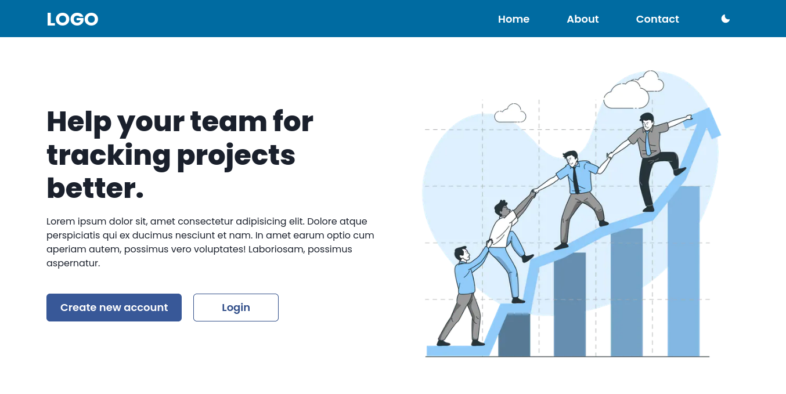

<h1 align="center">Next.js Chakra UI Template</h1>

<div align="center">

<a href="https://cna-chakra-ui-template.vercel.app/">View Demo</a>
·
<a href="https://github.com/imadatyatalah/cna-chakra-ui-template/issues">Report Bug</a>
·
<a href="https://github.com/imadatyatalah/cna-chakra-ui-template/issues">Request Feature</a>

</div>

<div align="center">

[](https://www.codefactor.io/repository/github/imadatyatalah/cna-chakra-ui-template)
[](https://github.com/imadatyatalah/cna-chakra-ui-template/blob/main/LICENSE)
[](https://github.com/imadatyatalah/cna-chakra-ui-template/stargazers)
[](https://github.com/imadatyatalah/cna-chakra-ui-template/network/members)

</div>

### Built With

- [Next.js](https://nextjs.org/)
- [Chakra UI](https://chakra-ui.com/)

### Features

- ESLint ready.
- Dark Mode ready.
- SEO friendly.

### Screenshot



## Deploy

[](https://vercel.com/new/clone?repository-url=https%3A%2F%2Fgithub.com%2Fimadatyatalah%2Fcna-chakra-ui-template&demo-title=Next.js%20and%20Chakra-UI%20Template.&demo-url=https%3A%2F%2Fcna-chakra-ui-template.vercel.app%2F&demo-image=https%3A%2F%2Fraw.githubusercontent.com%2Fimadatyatalah%2Fcna-chakra-ui-template%2Fmain%2Fscreenshot.png)

## Getting Started

Create a new application using `create-next-app` with the `-e | --example` flag pointing to this repository's _url_, like so:

```bash
npx create-next-app@latest --example https://github.com/imadatyatalah/cna-chakra-ui-template
```

> **Tip:** You can find `create-next-app`'s documentation at [https://nextjs.org/docs/api-reference/create-next-app](https://nextjs.org/docs/api-reference/create-next-app).

You can also click on the `Use this template` button.

After that, clone the repository that was created on your account and follow the steps below:

```bash
# Installing project dependencies
yarn
# Starting the project
yarn dev
```

Your site is now running at [`http://localhost:3000`](http://localhost:3000)!

## License

Distributed under the MIT License. See [`LICENSE`](https://github.com/imadatyatalah/cna-chakra-ui-template/blob/main/LICENSE) for more information.
